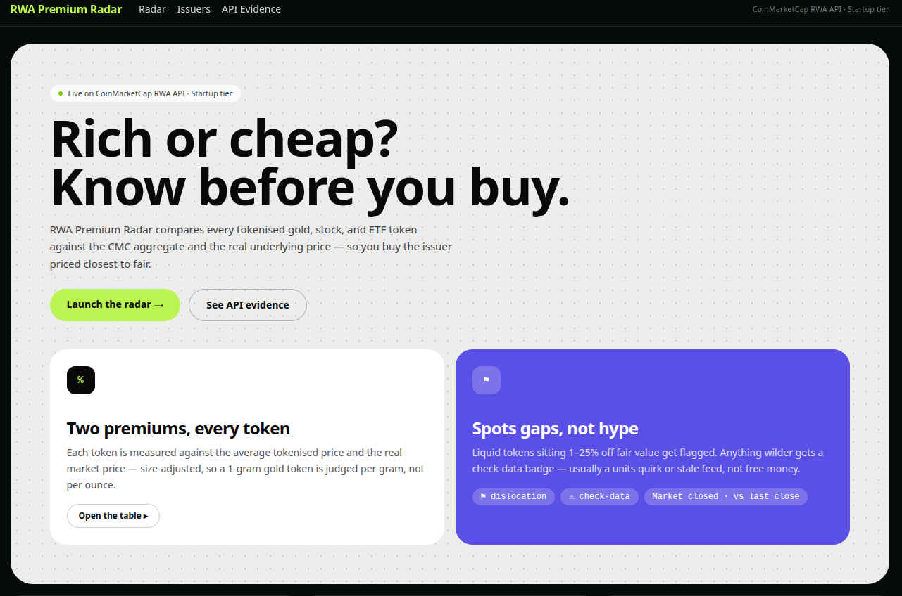
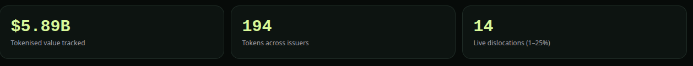
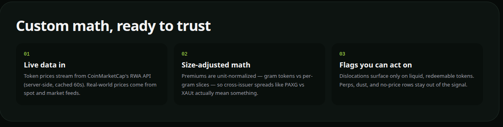
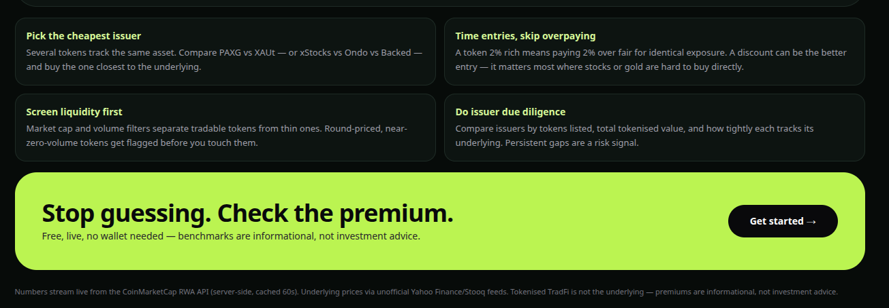
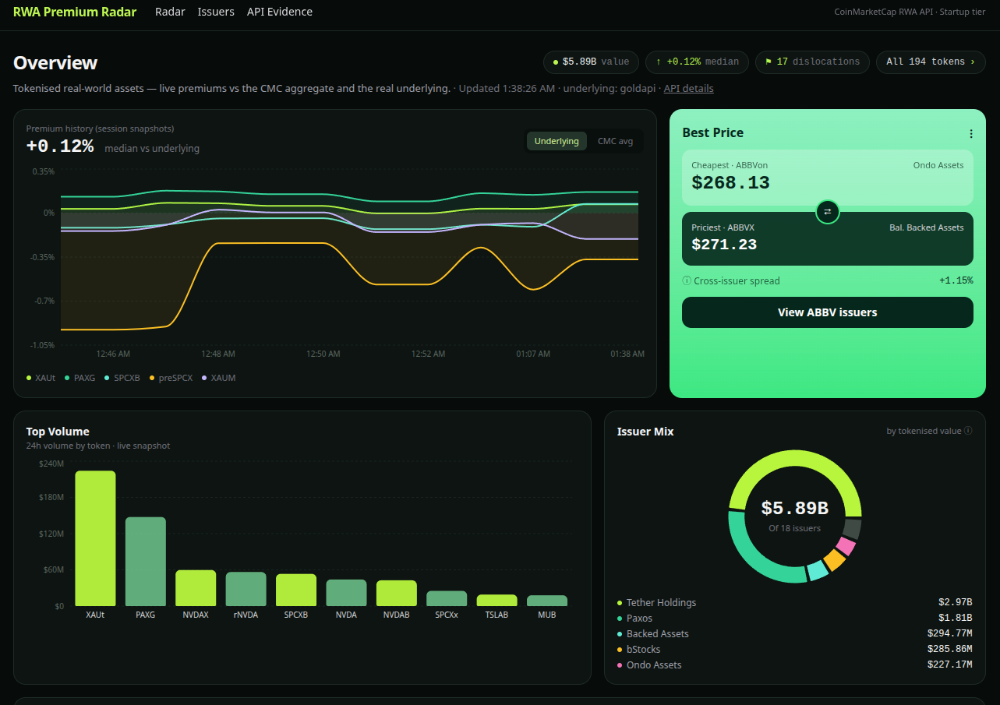

# RWA Premium Radar

A dashboard for tokenised real-world assets (gold, stocks, treasuries, ETFs). It answers one
question for holders and traders of tokenised TradFi: **is this token trading rich or cheap — and
which issuer is best?**

Built for the CoinMarketCap **“Build with CMC” API Hackathon — Real World Assets track**.

- **Landing** (`/`): hero + feature cards + live stats band (tokenised value, token count,
  dislocations) + how-it-works + use cases, with CTAs into the radar.
- **Radar overview** (`/radar`): premium-history chart (session snapshots, underlying/aggregate
  toggle), Best Price cross-issuer card, top-volume bars, issuer-mix donut, dislocation strip,
  plus the radar table below.
- **Radar table** (`/radar#radar-table`): one row per token — price, premium vs the CMC aggregate tokenised price,
  premium vs the real underlying market price, market cap, 24h volume. Sortable, filterable by
  asset type, searchable. Premiums/discounts are color-coded with a ⚑ flag on |premium| > 1%, plus
  a “Biggest dislocations” strip.
- **Market-state honesty**: when the underlying market is closed (nights/weekends for US
  equities), premiums show a “Market closed · vs last close” badge instead of a fake live signal.
- **Issuers** (`/issuers`, `/issuers/[id]`): issuer directory, tokens-per-issuer chart, per-issuer
  detail with linked tokens joined to live prices/premiums and total tokenised value.
- **Asset detail** (`/assets/[SYMBOL]`): per-issuer token table + a premium-history chart. CMC has
  no historical RWA endpoint, so history is built from 60s client snapshots (persisted in
  localStorage, last ~200 points) and honestly labeled “since you opened the dashboard”.
- **API Evidence** (`/evidence`): one live call per endpoint with raw (truncated) JSON, timestamp
  and `credit_count` — proof of real API usage for judging.


## Screenshots











## Setup

```bash
npm install
cp .env.example .env.local   # then put your CMC key in .env.local
npm run dev                  # http://localhost:3000
npm test                     # vitest unit tests (premium math)
npm run build
```

The CMC key lives **only** in `CMC_API_KEY`, read in server route handlers (`lib/cmc.ts`). It is
never sent to the client and never committed (`.env*` is gitignored; `.env.local` holds the real
key locally, `CMC_API_KEY` must also be set in Vercel → Project → Settings → Environment
Variables).

## Endpoints used

| Endpoint | Purpose in this app | Credits (observed, Startup tier) |
|---|---|---|
| `GET /v5/real-world-assets/map` | Resolve `rwa_id`/symbol universe (top 30 by rank); 0-credit discovery call | 0 |
| `GET /v5/real-world-assets/quotes/latest` | Core data: per-asset `tokens[]` (symbol, price, market_cap, volume_24h, issuer_id, issuer_name) + `average_tokenized_price` | 1 per call |
| `GET /v5/real-world-assets/assets/list` | Aggregate tokenised price / mcap per asset (shown on Evidence page) | 1 per call |
| `GET /v5/real-world-assets/info` | Asset metadata (shown on Evidence page) | 1 per call |
| `GET /v5/real-world-assets/issuers/list` | Issuer directory (25 issuers) | 1 flat |
| `GET /v5/real-world-assets/issuers?issuer_id=…` | Single issuer + linked tokens (joined with quotes for prices) | 1 flat |
| `GET /v5/real-world-assets/market-pairs/list` | **Not used** — Growth+ only; returns `1006` on Startup. Attempted once on the Evidence page to document the tier gate | 0 (rejected) |

Server routes cache with Next `revalidate` (60s for quotes-derived data, 300s for issuers,
3600s for map) since upstream refreshes every 30–60s — saves credits and avoids 429s. `401/403/429`
from CMC surface as a friendly error banner, never a stack trace.

## Real captured request/response (key redacted)

Request (verified 2026-09-30):

```bash
curl -H "X-CMC_PRO_API_KEY: <redacted>" \
  "https://pro-api.coinmarketcap.com/v5/real-world-assets/quotes/latest?symbol=GOLD,NVDA"
# → status: { "error_code": 0, "credit_count": 1 }
```

Response (trimmed):

```json
{
  "data": {
    "rwa_assets": [
      {
        "name": "Gold", "symbol": "GOLD", "rwa_id": 1, "asset_type": "commodity",
        "average_tokenized_price": 4162.597575067926,
        "tokenized_market_cap": 4876084764.05,
        "tokens": [
          { "symbol": "PAXG", "name": "PAX Gold", "price": 4166.270236597787,
            "market_cap": 1812621652.18, "issuer_id": "68904c24…", "issuer_name": "Paxos", "crypto_id": 4705 },
          { "symbol": "XAUt", "name": "Tether Gold", "price": 4161.678005439047,
            "market_cap": 2951976672.61, "issuer_name": "Tether Holdings", "crypto_id": 5176 },
          { "symbol": "CGO", "name": "Comtech Gold", "price": 133.40258370550495,
            "issuer_name": "Comtech Gold", "crypto_id": 20245 }
        ],
        "tradfi_markets": []
      }
    ]
  },
  "status": { "error_code": 0, "credit_count": 1 }
}
```

Note `CGO ≈ $133` while the aggregate is ≈ `$4162/oz`: CGO is **1 gram** of gold, which is why
per-token `unitsPerToken` mapping matters (see below). `tradfi_markets[]` carries exchange
listings, not prices — underlying prices come from the free feeds below.

## How premiums are computed

Pure functions in `lib/premium.ts` (unit-tested, `npm test` — 10 tests):

- `premiumVsAggregate = (token.price / asset.average_tokenized_price − 1) × 100`
- `premiumVsUnderlying = (token.price / (underlying.price × unitsPerToken) − 1) × 100`
- `issuerSpread = (max − min) / min × 100` across an asset’s issuer token prices
- All guards return `null` on zero/missing input — never `NaN`.

Units come from an explicit whitelist (`lib/mapping.ts`): token-level for gold
(PAXG/XAUt/XAUM = 1 oz, CGO/VNXAU/KAU = 1 g = 1/31.1035 oz), asset-level for GOLD (GC=F) and top
stocks (NVDA, AAPL, TSLA, … = 1 share). Anything unmapped shows **“no reference price”** — never a
fake number.

Underlying prices (`lib/underlying.ts`) are fetched server-side: Yahoo Finance chart endpoint
primary (`query1` → `query2` mirrors, `GC=F` for gold, ticker-as-is for stocks), Stooq CSV
fallback, 4s timeout, 60s cache, all failures → `null`. Market-open state is derived from Yahoo’s
`currentTradingPeriod` windows. The asset history chart prefers premium-vs-underlying but falls
back to premium-vs-aggregate (pure CMC data) with an honest label if the free feed is down, so the
graph always has something to show.

## Limitations (known, honest)

- Underlying prices come from **unofficial** free feeds (Yahoo/Stooq), not a licensed market-data
  vendor; treat sub-1% prints as noise.
- CMC has **no historical RWA endpoint** on this tier — the history chart is session-local
  snapshots (“since you opened the dashboard”), not exchange history.
- `market-pairs/list` is **Growth+ tier-gated** (verified: HTTP 403 / error `1006` on Startup), so
  spreads are computed across issuers rather than across exchange pairs.
- `premiumVsAggregate` compares each token to the asset’s average tokenised price as documented;
  fractional-size tokens (e.g. gram-denominated gold) therefore show large aggregate deviations —
  the per-underlying premium is the meaningful column for those.
- Some tokens quote with `price: null` (e.g. unlisted tickers) and render as “—”.

## What the API made possible / where it got in the way

- **Made possible:** a single `quotes/latest` call returns tokens, issuers, and the aggregate
  price together — the whole Radar table is essentially one cached request. `map` at 0 credits is
  a perfect discovery endpoint, and flat-1-credit issuer endpoints make the issuer view cheap.
- **Got in the way:** no historical endpoint (hence the snapshot workaround); `tradfi_markets[]`
  looked like underlying prices but is only exchange-listing metadata; `market-pairs` being
  Growth-gated removes true cross-venue spreads on the Startup tier; `average_tokenized_price`
  mixes token sizes (oz vs gram gold), so fractional tokens need the units mapping to be read
  correctly. All of the above were handled in-app rather than worked around with mock data.
